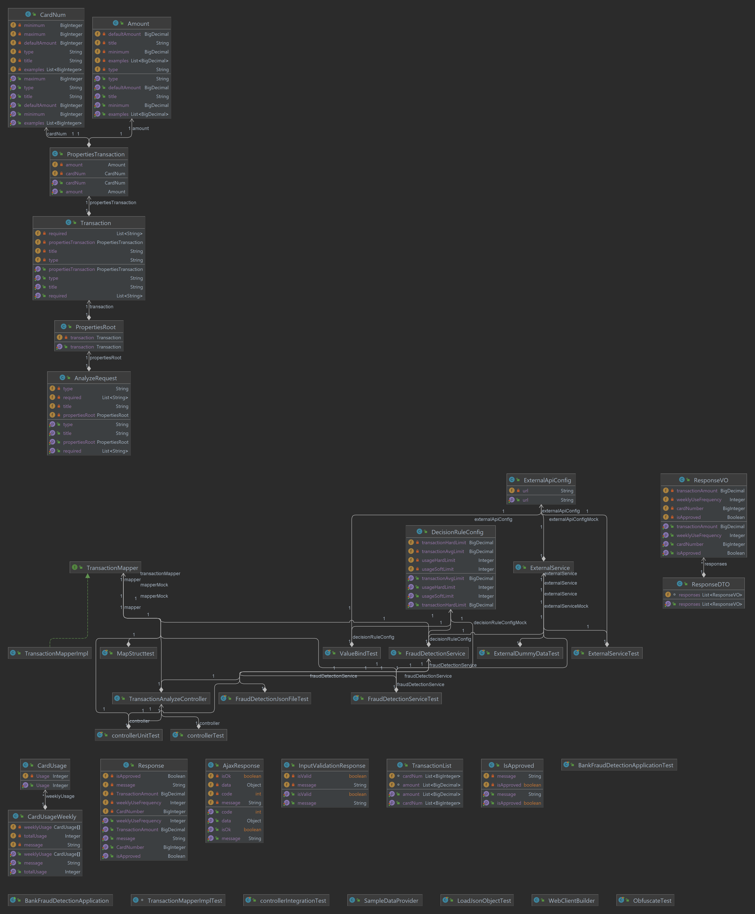

# Bank Fraud Detection Service

This is a simple credit card fraud detection service, provide a REST API endpoint named "/analyzeTransaction" that takes in a json object of 1 transaction with properties for card number and transaction amount. Calls another service to get information regarding the transaction, and 
then applies some business logic before returning a decision to approve or decline the transaction.

## Functional Requirement
    Service has 1 endpoint ( "/analyzeTransaction") takes in serveral parameters as inputs
    Call another service to get information regarding the transaction
    Apply some business logic.
    Responed a JSON object

## Non Functional Requirement
    Monitoring -endpoint to show basic stats
    Packaging- build a docker image
    Test - unit test(integration test), coverage report, load-test.
    Service should be able to handle and respond to input errors.
    Service should log the following underlined transaction information for debugging

Add a time limit for connect to external api.
    
## Business Logic
    If the amount of a transaction is over $50,000.00 decline the transaction.
    If the card has been used over 60 times in the last 7 days, decline the transaction.
    If the card has been used under 35 times in the last 7 days, decline the transaction if the (transaction amount/times used in last 7 days) > 500. (E.
    g. Decline if transaction amount is $9000 and the card has been used 2 times in the last 7 days. 9000/2 = 4500)
    Approve all other transactions

### Input Error Handling
    The request body would be checked: 
        1. Card number and amount count does not match:   Response with isValid : False,  Message: Input amount count does not match card number count
        2. Card number is over maximum: Message:          Response with isValid : False,  Message: Card number is over Max limit, Error Input
        3. Card number is under minimum:                  Response with isValid : False,  Message: Card number is under Min limit, Error Input
        4. Transaction Amount is under minimum:           Response with isValid : False,  Message with: Transaction amount is under min limit, Error Input

### External API connection
The system design includes calling an external API to retrieve data, and if the API fails to return data within a specified time limit, an exception will be thrown. 
If no data is returned, a "not found" error message will be returned to the requester. 
In the event of a server outage or other disruption of the external API, the system is designed to provide randomly generated data to ensure continued service availability. This feature is intended for development and testing purposes only.

### Obfuscate Card Number
The system achieves masking of credit card numbers by overriding the toString() function in the ResponseVO, Response, and CardNum model classes. The implementation masks the card number only if its length is over 13 digits. However, this approach may have the drawback of accidentally calling other functions that print out the card number, leading to unintended disclosure.
An alternative approach to masking credit card numbers is to use a custom log mask pattern. This approach may impact system performance, and the rules for defining the masking pattern may be complex. Nevertheless, this approach offers the advantage of greater flexibility in masking patterns and can provide more robust protection of sensitive data.

### Unit Test
    coverage: 
        Class: 100%
        Method: 100%
        Line: 97%

The 3% untested line is from mapstruct auto generated lines.
Since it's a lot line about test if the input is null, so used null object to test against part of the mapstruct object.

### Load Test
    Used Jmeter for load test

### SwaggerUI
    http://localhost:8080/swagger-ui/index.html
    
### Endpoint
    http://localhost:8080/analyzeTransaction

### Observability
    http://localhost:8081/

    Here enabled expose all information on the port in the dev profile, can limit the exposure in test or prod profile.

    Ideally would have a system to collect customed metrics and expose to port, use promethus to scrap the metrics and Grafana for visualization. Can also add istio and visulize the traffic use kiali.

### Docker Image
    docker build -t mastercard-fraud-server .
    docker run -p 8080:8080 -p 8081:8081 mastercard-fraud-server

### UML Diagram

